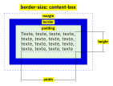

Maîtrisez le modèle de boîte
============================

Les éléments d’une page HTML sont divisés en 2 catégories :

- éléments en ligne,
- éléments bloc.

Utilisez le bon modèle de boîte
-------------------------------

Tous les éléments bloc d’une page HTML sont soumis à un modèle de boîte. Il en existe deux.

### Modèle de boîte standard `content-box`

### Modèle de boîte alternatif `border-box`

Domptez la marge extérieure `margin`
------------------------------------

La marge extérieure a un comportement déroutant quand on ne comprend pas son mode de fonctionnement.

Elle est très différente de la marge intérieure `padding` :

- elle est obligatoirement transparente,
- elle peut être négative,
- elle indique un espace minimum à réserver autour de la boîte,
- elle ne fait pas partie de la boîte,
- les marges extérieures haute et basse fusionnent selon certaines conditions, mais pas les marges extérieures gauche et droite.

Les [règles de fusion](https://developer.mozilla.org/fr/docs/Web/CSS/Mod%C3%A8le_de_bo%C3%AEte_CSS/Fusion_des_marges) sont souvent obscures pour un débutant.

À quelques exceptions près, la fusion de marge n’a pas lieu quand :

- une bordure ou une marge intérieure se trouve entre deux marges extérieures,
- un nouveau contexte de formatage de bloc est déclenché à l’intérieur d’un élément bloc par l’une des déclarations suivantes :
    - float: left/right,
    - position: absolute,
    - display: inline-block/table-cell/table-caption,
    - overflow: auto/hidden/scroll,
    - overflow-x: auto/hidden/scroll,
    - overflow-y: auto/hidden/scroll.

Comprenez la couleur de fond `background-color`
-----------------------------------------------

La couleur de fond est peinte sous :

- le contenu,
- la marge intérieure,
- la bordure.

Si vous utilisez une bordure en pointillés, l’espace entre ces pointillés sera rempli avec la couleur de fond.