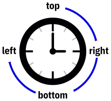

Utilisez des astuces qui vous simplifient la vie
================================================

Voici quelques techniques qui simplifient grandement la vie.

## Empêchez vos images de déborder

Le CSS impose une largeur maximum à 100% du conteneur. La hauteur est calculé automatiquement pour respecter les proportions de l’image originale.

```CSS
img {
    max-width: 100%;
    height: auto;
}
```

## Arrondissez vos photos

Si vos images sont carrées, vous obtiendrez un cercle parfait avec le code ci-dessous. Vous pouvez toujours changer l’épaisseur et la couleur de la bordure.

```CSS
img {
    border-radius: 50%;
}
```

## Pensez aux aiguilles d’une montre

Les valeurs données dans les raccourcis suivent le sens des aiguilles d’une montre :



Par exemple, les deux définitions ci-dessous sont équivalentes :

```CSS
.classe {
    margin: 1em 0.5em 2em 3em;
}

.classe {
    margin-top: 1em;
    margin-right: 0.5em;
    margin-bottom: 2em;
    margin-left: 3em;
}

```

## Utilisez `em` et `rem` pour l’écran

Les unités absolues (`cm`, `mm`, `Q`, `in`, `pc`, `pt` et `px`) sont problématiques pour définir des styles à destination des écrans tant les dimensions et résolutions d’écran peuvent varier. Et, pour information, l’unité `px` ne correspond pas à un pixel physique contrairement à ce que son nom laisse supposer.

Les unités relatives permettent de s’adapter à l’écran de l’utilisateur et de respecter ses choix en matière de taille de police.

Il y a deux unités que vous devez utiliser et avec lesquelles il faut vous habituer :

- `em`, 1em = 1× la taille de la police de l’élément courant,
- `rem`, 1rem = 1× la taille de la police par défaut.

L’unité `em` est très pratique pour définir des marges ou des espacements en rapport avec la taille de la police courante. Les valeurs varient alors entre `0.5em` et `2em`.