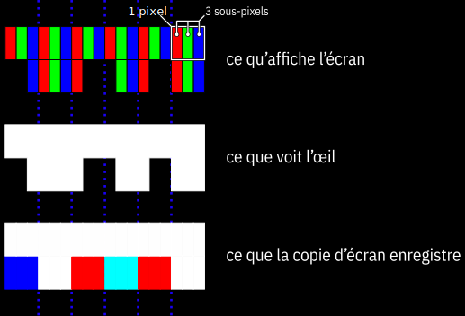

Faites de bonnes captures d’écran
=================================

Pour diverses raisons, vous pouvez être amenés à réaliser une capture d’écran pour l’intégrer sur une page web.

Utilisez l’original plutôt que la copie
---------------------------------------

Il est toujours préférable de partir de l’original plutôt que de la copie.

Plusieurs problèmes se posent lorsque vous faites une copie d’écran.

### La résolution de l’écran

Il y a de fortes chances que la configuration de votre poste de travail ne corresponde pas du tout avec celle de vos utilisateurs, du simple fait que chaque utilisateur a une configuration différente de son voisin.

Si votre résolution d’écran est inférieure à celle de vos utilisateurs, à taille identique, une copie d’écran apparaîtra plus floue, moins nette sur leurs écrans.

### La réduction des images affichées

Les images affichées sur un écran ont probablement été réduite pour l’affichage même si l’image téléchargée est en réalité plus grande.

Sous Firefox, il existe une fonction appelée **Informations sur la page**, située dans le menu **Outils**. La fenêtre qu’elle affiche dispose d’un onglet **Médias** listant toutes les images chargées pour la page et un bouton **Enregistrer sous…** pour récupérer le fichier original.

### L’optimisation sous-pixel des polices

Faire une copie d’écran d’une zone contenant du texte est souvent une mauvaise idée car le rendu des caractères utilise la technique des sous-pixels pour améliorer le rendu visuel.

Cette technique permet tripler virtuellement la résolution selon un axe.

Étant totalement dépendante de l’organisation des sous-pixels de l’écran, elle rend la copie d’écran valable uniquement pour les écrans utilisant la même organisation.

Si les écrans d’ordinateur utilisent généralement la même disposition (rouge puis vert puis bleu horizontalement), les écrans des tablettes et smartphones présentent des topologies très variées.

Outre la perte de qualité au changement d’écran, elle implique également un taux de compression moindre car elle introduit des couleurs supplémentaires.

Zoomez avant la capture
-----------------------

Si vous faites une capture d’écran sur une page web, forcez le navigateur à faire un zoom (généralement à l’aide des combinaisons de touches Ctrl + et Ctrl -).

Enregistrez en PNG
------------------

Si possible, enregistrez l’image au format PNG. Les captures d’écran en JPG font très rapidement apparaître des artefacts sur les zones à fort contraste (notamment au niveau des textes).

Quand les fonctions de capture d’écran intégrées au système d’exploitation ne vous permettent pas de choisir, vous pouvez recourir à des applications dédiées.

The Gimp, par exemple, dispose d’une fonction de capture d’écran intégrée.
