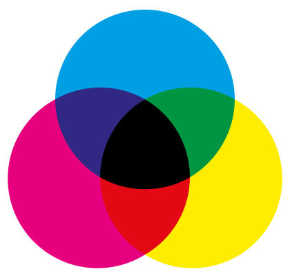
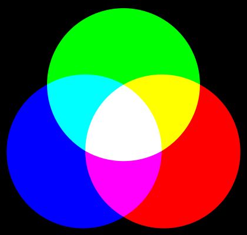

Demandez du RVB à votre graphiste
=================================

## Comprenez les 2 types de synthèse

Il y a deux types principaux de synthèse de couleur : la synthèse additive et la synthèse soustractive.

Comprendre ces deux types de synthèse vous permettra de mieux échanger avec nos amis graphistes.

Sans entrer dans les détails, retenez que :

- en **synthèse additive**, plus on en rajoute plus on tend vers du lumineux,
- en **synthèse soustractive**, plus on en rajoute plus on tend vers du sombre.

C’est aussi simple que ça !

En tant qu’intégrateur vous rencontrerez principalement deux systèmes :

- le **RVB** ou rouge-vert-bleu en synthèse additive, utilisé par les écrans   LCD/LED et les vidéo-projecteurs,
- le **CMJN** ou cyan-magenta-jaune-noir en synthèse soustractive, utilisé pour   les impressions (fonctionne comme la peinture).

Si on reprend la définition empirique des deux synthèses, tout s’éclaire. Votre écran d’ordinateur est noir et il faut l’éclaircir pour qu’une image apparaise. Votre feuille de papier est blanche et il faut l’assombrir pour qu’une image apparaisse.

## Comprenez votre graphiste

Un graphiste « print » travaille principalement en CMJN, il a même appris à manipuler les couleurs dans ce système. Il n’est donc pas rare qu’un intégrateur se retrouve avec des fichiers en CMJN.

Les deux systèmes sont, normalement, complémentaires. Le mélange du rouge, du vert et du bleu permet d’obtenir du cyan, du magenta et du jaune et inversement.

Mais le cyan, le magenta et le jaune du CMJN ne sont pas du tout ceux du RVB ! Les images ci-dessous représentent les mélanges de couleurs dans les deux systèmes.

## Ne cherchez pas à convertir du CMJN en RVB

Si jamais vous vous aventuriez dans la conversion CMJN vers RVB, vous pourriez avoir de mauvaises surprises. Les recherches vous amènent rapidement à effectuer une conversion utilisant uniquement les cyan, magenta et jaune du RVB. Cela donne des images aux couleurs criardes ou en négatif.

Il est préférable de préciser au graphiste qu’il doit livrer les fichiers en RVB car il est normalement en mesure de faire une conversion propre.

## Travaillez en RVB

Le web fonctionnant avant tout sur des écrans, un seul mot d’ordre : **RVB** ! Et plus précisément **sRVB**, histoire de simplifier.

De plus, un fichier CMJN sera toujours plus lourd, du fait de sa couleur supplémentaire, qu’un fichier RVB.
