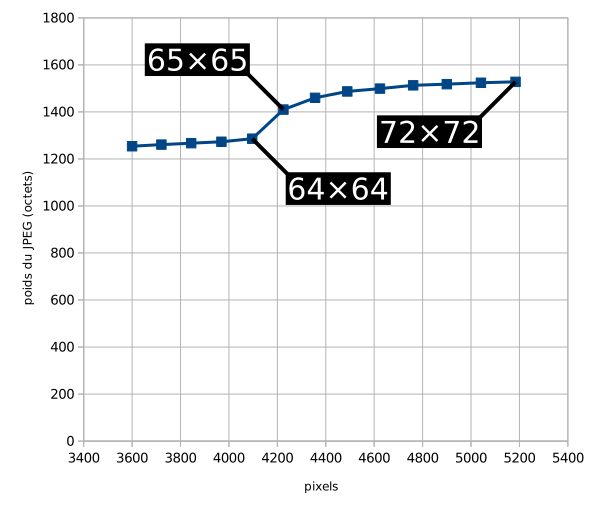

Pensez multiples de 8 pour les JPEG
===================================

Le format JPEG découpe toutes les images en carrés de 8×8 pixels.

Toute image n’ayant pas des dimensions multiples de 8 aura une pénalité dont l’importance sera d’autant plus grande que l’image sera petite.

Le diagramme ci-dessous montre cette pénalité lorsque l’image passe de 64×64 (multiple de 8) à 65×65.

Il faut aussi penser multiples de 8 lorsque vous voulez découper un JPEG car cela garantit le moins de pertes possibles.
