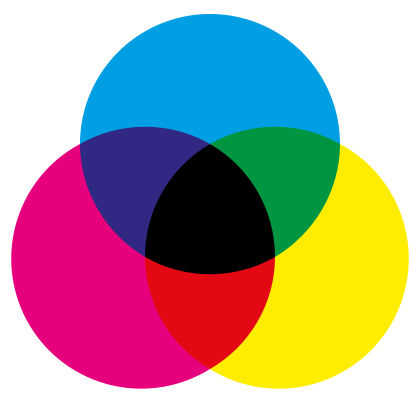
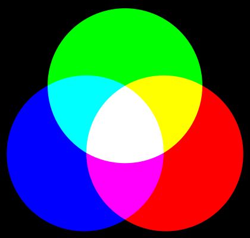
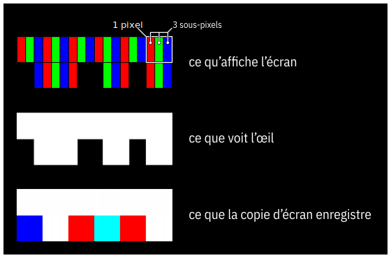
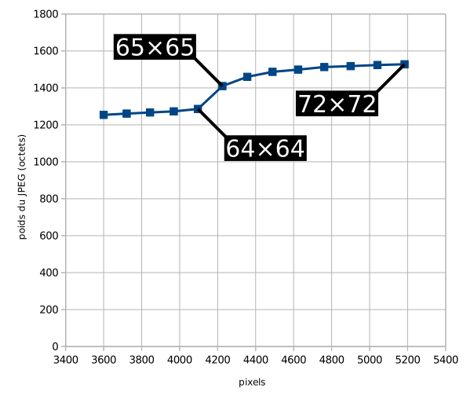

    ////////////////////////////////////////////
    ///                                      ///
    ///   DOCUMENT EN COURS DE RÉDACTION !   ///
    ///                                      ///
    ////////////////////////////////////////////

Trucs et astuces pour intégrateurs en herbe
===========================================

Cet article s’adresse à tout débutant en intégration, opération consistant à transformer une maquette en gabarit pour un CMS.

Il ne parle pas d’automatisation, d’industrialisation, de CI, de CD…

On va tout d’abord s’attaquer à un gros morceau : les images.

## Choisissez le format d’image le plus adapté

### Demandez du RVB à votre graphiste

Il y a deux types principaux de synthèse de couleur : la synthèse additive et la synthèse soustractive.

Comprendre ces deux types de synthèse vous permettra de mieux échanger avec nos amis graphistes.

Sans entrer dans les détails, retenez que :

- en **synthèse additive**, plus on en rajoute plus on tend vers du lumineux,
- en **synthèse soustractive**, plus on en rajoute plus on tend vers du sombre.

C’est aussi simple que ça !

En tant qu’intégrateur vous rencontrerez principalement deux systèmes :

- le **RVB** ou rouge-vert-bleu en synthèse additive, utilisé par les écrans   LCD/LED et les vidéo-projecteurs,
- le **CMJN** ou cyan-magenta-jaune-noir en synthèse soustractive, utilisé pour   les impressions (fonctionne comme la peinture).

Si on reprend la définition empirique des deux synthèses, tout s’éclaire. Votre écran d’ordinateur est noir et il faut l’éclaircir pour qu’une image apparaise. Votre feuille de papier est blanche et il faut l’assombrir pour qu’une image apparaisse.

Un graphiste « print » travaille principalement en CMJN, il a même appris à manipuler les couleurs dans ce système. Il n’est donc pas rare qu’un intégrateur se retrouve avec des fichiers en CMJN.

Les deux systèmes sont, normalement, complémentaires. Le mélange du rouge, du vert et du bleu permet d’obtenir du cyan, du magenta et du jaune et inversement.

Mais le cyan, le magenta et le jaune du CMJN ne sont pas du tout ceux du RVB ! Les images ci-dessous représentent les mélanges de couleurs dans les deux systèmes.

Si jamais vous vous aventuriez dans la conversion CMJN vers RVB, vous pourriez avoir de mauvaises surprises. Les recherches vous amènent rapidement à effectuer une conversion utilisant uniquement les cyan, magenta et jaune du RVB. Cela donne des images aux couleurs criardes.

Il est préférable de préciser au graphiste qu’il doit livrer les fichiers en RVB car il est normalement en mesure de faire une conversion propre.

Le web fonctionnant avant tout sur des écrans, un seul mot d’ordre : **RVB** !

De plus, un fichier CMJN sera toujours plus lourd, du fait de sa couleur supplémentaire, qu’un fichier RVB.

### Vectoriel ou bitmap ?

Il existe deux techniques pour décrire une image :

- le **bitmap** énumère chaque point composant l’image,
- le **vectoriel** énumère chaque élément composant l’image.

#### Le bitmap

Le bitmap est contenu dans des fichiers au format JPEG, PNG, GIF, TIFF etc.

C’est le fonctionnement natif d’un écran d’ordinateur, d’un appareil photo ou d’une imprimante laser.

Sans prendre en compte la compression, le poids d’un bitmap est déterminé par le nombre de points utilisés et les informations de couleur attribuées à chaque point.

Le bitmap présente l’inconvénient d’être pixellisé à mesure que l’on zoome (effets escalier) mais est bien adapté à la représentation d’images naturelles comme les photographies.

Il y a 3 formats bitmap à utiliser sur le web :

- **JPEG**, dans sa version originale (oubliez le [JPEG 2000](https://caniuse.com/#feat=jpeg2000), le [JPEG XR](https://caniuse.com/#feat=jpegxr) ou le JPEG à encodage arithmétique car ils sont très peu supportés par les navigateurs), pour toutes les images « naturelles »
- **PNG**, 
- **APNG**, le [PNG animé](https://caniuse.com/#feat=apng), équivalent du GIF animé pour le PNG avec support de la transparence alpha, est désormais bien supporté dans les navigateurs à l’exception d’Internet Explorer et de Edge avant son passage à Webkit.
- **GIF**,

#### Préférez APNG (voire MP4 ou WEBM) à GIF

[L’APNG a longtemps été boudé par les navigateurs](https://caniuse.com/#search=apng) à l’exception de Firefox, il est supporté par Chrome depuis 2017.

APNG présente les avantages suivants par rapport à GIF :

- meilleur taux de compression
- support de la transparence alpha

Comme GIF, APNG doit être réservé à :

- des animations courtes car il n’y a pas de système de contrôle de l’animation,
- en boucle pour la même raison,
- nécessitant la transparence,
- pour des images peu complexes.

Pour de courtes séquences (ex. meme) souvent tirées de films, un format vidéo comme MP4 ou WEBM est préférable.

Et contrairement à la plupart des formats vidéo, [WEBM supporte la transparence alpha](https://simpl.info/videoalpha/) et cette fonctionnalité est supportée par Chrome et Firefox mais pas Safari.

La difficulté repose sur la création d’une telle animation. En termes de simplicité, le GIF est plus simple à produire que l’APNG, lui-même plus simple à produire que le WEBM transparent.

#### Le vectoriel

Le vectoriel est contenu dans des fichiers au format SVG ou AI. Ce dernier format étant propriétaire, il n’est pas utilisé pour la visualisation d’images vectorielles.

Sans prendre en compte la compression, le poids d’une image vectorielle est déterminé par le nombre d’éléments utilisés.

Le vectoriel présente l’avantage d’un niveau de qualité constant à mesure que l’on zoome mais n’est pas adapté à la représentation d’images naturelles.

C’est cet avantage qui permet au vectoriel d’avoir le rendu le plus fin possible quel que soit le périphérique de rendu utilisé. Si le moteur de rendu du vectoriel est suffisamment avancé, il peut même profiter des sous-pixels d’un écran pour tripler la résolution horizontale perçue.

Le vectoriel, notamment SVG, a eu un regain d’intérêt ces dernières années pour deux raisons. Tout d’abord SVG est largement supporté que ce soit sur desktop ou sur mobile. Ensuite la grande variété de résolutions d’écran ainsi que l’explosion du nombre de pixels le rendent particulièrement pratique.

#### Convertir du vectoriel en bitmap

Tous les logiciels de dessin vectoriel propose un export en bitmap étant donné que la conversion est simple à réaliser.

Il faut cependant éviter d’y recourrir.

Le moteur de rendu SVG d’un navigateur peut effectuer des optimisations en fonction du matériel utilisé pour l’affichage.

On perd également la capacité du vectoriel à s’adapter à n’importe quel résolution d’écran.

#### Convertir du bitmap en vectoriel

L’opération inverse est plus difficile puisqu’elle nécessite que le logiciel devine à quelle forme correspondent une série de pixels.

Mais elle peut être particulièrement utile.

### Technologie sous-pixel et copie d’écran

Faire une copie d’écran d’une zone contenant du texte est souvent une mauvaise idée car le rendu des caractères utilise la technique des sous-pixels pour améliorer le rendu visuel.

Cette technique permet tripler virtuellement la résolution selon un axe.

Étant totalement dépendante de l’organisation des sous-pixels de l’écran, elle rend la copie d’écran valable uniquement pour les écrans utilisant la même organisation.

Si les écrans d’ordinateur utilisent généralement la même disposition (rouge puis vert puis bleu horizontalement), les écrans des tablettes et smartphones présentent des topologies très variées.

Outre la perte de qualité au changement d’écran, elle implique également un taux de compression moindre car elle introduit des couleurs supplémentaires.

### Optimisez vos images

#### Demandez du PNG 24 bits à votre graphiste

Afin de pouvoir optimiser le plus possible une image, il est important de partir de la source la plus pure.

Un JPEG, même quand on met la qualité à 100% lors de l’enregistrement, dégrade toujours les images.

Le PNG est un format sans perte de données qui supporte la transparence alpha.

C’est le format idéal pour la transmission des ressources entre graphiste et intégrateur.

#### Supprimez le superflux

Les formats JPEG et PNG peuvent contenir bien plus que l’image principale :

- méta-données **EXIF**  (conditions et paramètres de prise de vue),
- méta-données **IPTC**  (titre, auteur, copyright, description…),
- méta-données **XMP** (norme plus récente englobant IPTC),
- **vignette** (automatiquement ajoutée par les appareils photo),
- données propriétaires,
- profil colorimétrique **ICC**.

Mis à part le profil colorimétrique, les autres données ne sont pas utilisées par les navigateurs et sont donc chargées inutilement.

#### Travaillez en sRGB

Si votre graphiste a conscienceusement réglé son poste de travail, il y a fort à parier qu’il ou elle ait calibré son écran. Cette opération génère un profil colorimétrique que les logiciels de manipulation d’image un tant soit peu évolués (PhotoShop, Gimp…) ajoutent aux fichiers qu’ils produisent.

Hormis le poids supplémentaire d’un profil colorimétrique dans un fichier image, le support des profils colorimétriques varie d’un navigateur à l’autre.

Pour s’en convaincre, il suffit d’effectuer le test [Is your system ICC Version 4 ready?](http://www.color.org/version4html.xalter) :

- **Chrome 81** supporte tous les profils colorimétriques,
- **Firefox 75** supporte les profils colorimétriques en version 2 mais pas en version 4 ([cela fait toujours l’objet d’un ticket ouvert il y a 11 ans !](https://bugzilla.mozilla.org/show_bug.cgi?id=488800))

Bref, on a plutôt intérêt à ne pas embarquer de profil colorimétrique dans les ressources d’une page HTML, à la fois pour l’optimisation et le rendu final.

Quand aucun profil colorimétrique n’est embarqué, les navigateurs utilisent le [profil sRGB](https://fr.wikipedia.org/wiki/SRGB) ou IEC 61966-2-1 par défaut depuis les années 1990. C’est également précisé par le W3C dans [CSS Color Module Level 3](https://www.w3.org/TR/css-color-3/).

#### Pensez multiples de 8 pour les JPEG

Le format JPEG découpe toutes les images en carrés de 8×8 pixels.

Toute image n’ayant pas des dimensions multiples de 8 aura une pénalité dont l’importance sera d’autant plus grande que l’image sera petite.

Le diagramme ci-dessous montre cette pénalité lorsque l’image passe de 64×64 (multiple de 8) à 65×65.

Il faut aussi penser multiples de 8 lorsque vous voulez découper un JPEG car cela garantit le moins de pertes possibles.

#### Optimisez vos PNG avec TinyPNG

Le format PNG est propice à toutes sortes d’optimisation plus ou moins coûteuses que les logiciels (PhotoShop, Gimp etc.) n’implémentent pas, notamment celles concernant la transparence alpha.

[Le site TinyPNG](https://tinypng.com/) pallie ce manque.

Et, cerise sur le gâteau, TinyPNG gère parfaitement les fichiers APNG !

#### Optimisez vos SVG avec SVGOMG!

[SVGO](https://github.com/svg/svgo) est une bibliothèque NodeJS d’optimisation de fichiers SVG et [SVGOMG! ou SVGO Missing Gui](https://jakearchibald.github.io/svgomg/) est son interface utilisateur en ligne.

SVGOMG! va plus loin que la simple minification du code SVG. Il peut supprimer les balises inutiles au rendu, réduire la précision des coordonnées, factoriser des styles etc.

#### Optimisez vos JPEG

- compression JPEG
- compression PNG
- images CGI vs images naturelles
- réduction de couleurs
- copie d’écran (avec du texte)

### Favicons

- formats (historique et mobile)
- génération de favicons

### Regrouper des images

- fontes icônes WOFF, WOFF2
- sprites SVG

### Extraire des images

- attention aux copies d’écran

Il est toujours tentant de faire une copie d’écran

- extraction de bitmap d’un PDF
- extraction de vectoriel d’un PDF
- vectorisation d’un bitmap

## CSS

### Unifiez le rendu entre navigateurs avec CSS reset ou Normalize.css

Chaque navigateur embarque une feuille de style par défaut qui, bien sûr, n’est pas identique d’un navigateur à l’autre.

**CSS reset** et **Normalize.css** existent pour corriger les incohérences entre navigateurs.

Grâce à eux on se soucie un peu moins des différences de rendu entre navigateurs.

[CSS reset](https://meyerweb.com/eric/tools/css/reset/) fait en sorte que tous éléments se comportent de la même façon (aucune marge interne/externe, pas de graisse, même taille de caractères…)

[Normalize.css](https://necolas.github.io/normalize.css/) garantit que chaque élément se comporte de la même façon d’un navigateur à un autre.

Dans un souci d’optimisation, il faut garder en tête que CSS reset occupe moins de 800 octets une fois minimisé tandis que Normalize.css nécessite environ 1700 octets.

### CSS Zen Garden vs CSS composants

Lorsqu’on construit une feuille de styles CSS, il existe deux approches principales :

- l’approche orientée **documents**, telle qu’adoptée par CSS Zen Garden,
- l’approche orientée **composants**.

[CSS Zen Garden](http://www.csszengarden.com/) a été une véritable révolution pour les intégrateurs en 2003 : la plateforme démontrait la puissance des feuilles de style CSS à une époque où la mise en page des sites était encore faite à base de balises &lt;table&gt;, de styles en ligne et d’attributs dédiés à la forme.

L’approche orientée documents de CSS Zen Garden imposait que le CSS s’adapte au document. Sans changer la page HTML, de nouveaux thèmes étaient appliqués.

Cette approche impose une dépendance du CSS vis-à-vis du code HTML auquel il s’applique.

L’approche orientée composants est l’exacte opposée : c’est le code HTML qui va dépendre du CSS. Elle permet de réutiliser une feuille de style dans d’autres projets.

Cette approche est adoptée par les nouveaux frameworks tels que React, Angular, Vue etc.

### N’utilisez pas d’image pur CSS

Depuis CSS Zen Garden, CSS a parcouru tellement de chemin qu’on a vu apparaître les **images pur CSS**.

Sur le fond, ce sont des images vectorielles créées non pas avec du SVG mais avec du CSS et quelques balises HTML.

Voici un exemple de codage d’une telle image en vidéo :

Il s’agit d’une belle démonstration technique, à n’en pas douter, et vous en trouverez de nombreuses autres en faisant quelques recherches.

Elle pose néanmoins quelques problèmes :

- l’utilisation de balises vides dans le code HTML,
- des images qui ne sont pas identifiées comme telles ; là où un simple attribut alt permet de rendre une image accessible, une image pur CSS nécessite de placer du texte qu’on

### Mettez un attribut alt à toutes les images !

La règle est on ne peut plus simple : quelle que soit l’image, quel que soit le contenu de l’attribut, mettez toujours un attribut alt à chaque image.

L’attribut alt :

- est ignoré par les logiciels d’assistance s’il est vide (&lt;img alt=""&gt;),
- est utilisé par les logiciels d’assistance s’il est rempli,
- est affiché lorsque l’image n’a pas encore pu être chargée (ou que son URL est erronée).

Cela entraîne la question : comment remplir l’attribut alt pour être accessible ?

La Web Accessibility Initiative du W3C a un document très complet à ce sujet qui passe en revue toutes les catégories d’image que vous serez amenés à rencontrer et comment remplir l’attribut alt en conséquence : [Web Accessibility Tutorials, Guidance on how to create websites that meet WCAG, Images](https://www.w3.org/WAI/tutorials/images/).

Si vous cherchez à faire apparaître un texte lorsque le curseur souris survole une image, c’est l’**attribut title** qu’il vous faut.

### Utilisez l’attribut class, pas l’attribut id

Chaque élément d’une page HTML peut se voir attribuer :

- une ou plusieurs classes via l’attribut **class**,
- un identifiant unique à travers toute la page via l’attribut **id**.

La bonne pratique impose d’utiliser l’attribut **class**. Vous ne devriez pas avoir, sauf cas exceptionnel, de sélecteur CSS pour des identifiants dans votre feuille de styles.

### Restez en dessous de 14 Ko

Si vous prenez la version minifiée de Bootstrap (bootstrap.min.css), vous vous retrouvez avec un CSS de 160 Ko. En activant la compression GZip sur le serveur web, ce fichier sera au mieux réduit à 23 Ko lors de son voyage à travers le réseau.

C’est peu mais ça reste problématique :

- si le serveur ne dispose pas de mise en cache, le fichier sera **compressé à chaque envoi**,
- le navigateur **interprètera et gérera** 160 Ko de CSS,
- on reste au-dessus de la **barrière des 14 Ko**.

Lorsqu’on fait son intégration en local, difficile de se rendre compte à quel point tout ceci est lourd à gérer même en considérant la puissance des processeurs et l’optimisation des navigateurs.

D’où vient cette barrière des 14 Ko ? Il faut savoir que chaque nouvelle connexion TCP ne peut utiliser immédiatement toute la bande passante disponible. Elle doit passer par un démarrage lent pour éviter de surcharger la connexion. Dans ce processus, le serveur débute le transfert avec une petite quantité de données et, si cette quantité de données parvient correctement à destination, il double la quantité lors du prochain aller-retour.

Pour la plupart des serveurs, 14 Ko (soit 10 paquets) est le maximum transférable lors du premier aller-retour. [[Extract Critical CSS](https://web.dev/extract-critical-css/)]

Il faut donc chercher à garder une feuille de styles minifiée et compressée en dessous de ces 14 Ko.

Bien que cela soit valable pour les autres ressources d’une page, la feuille de style est critique car si elle n’est pas chargée complètement à temps

## Bien choisir ses frameworks et bibliothèques CSS et JS

- unités de mesure (px, mm, dpi…)
- choisir le bon format (PNG, SVG, JPG, GIF, MP4, WEBM…)

## Fichiers sources

- optimisation CSS
- optimisation JS (VanillaJS vs bibliothèques/framework)
- optimisation polices de caractères (fontsquirrel)

## Oubliez Internet Explorer

Si Microsoft maintient Internet Explorer sous Windows, c’est uniquement par souci de compatibilité afin de garantir à leurs clients qu’ils pourront continuer  d’utiliser des applications historiques fortement liées à ce navigateur.

Autrement dit, Microsoft recommande d’utiliser Internet Explorer uniquement avec les applications historiques et d’utiliser un navigateur moderne pour surfer sur le web [[The perils of using Internet Explorer as your default browser](https://techcommunity.microsoft.com/t5/windows-it-pro-blog/the-perils-of-using-internet-explorer-as-your-default-browser/ba-p/331732)]

Microsoft ne supporte plus qu’Internet Explorer 11, la version 10 ayant été abandonnée en janvier 2020. [[End of IE support](https://www.microsoft.com/fr-fr/microsoft-365/windows/end-of-ie-support)]

Cette absence de support se ressent même jusqu’aux machines virtuelles que Microsoft met d’ordinaire à disposition des développeurs pour tester leur site  sous Internet Explorer. Seule une machine virtuelle avec la version 11 est disponible [[Virtual Machines. Test IE11 and Microsoft Edge Legacy using free Windows 10 virtual machines you download and manage locally](https://developer.microsoft.com/en-us/microsoft-edge/tools/vms/)]

Doit-on supporter Internet Explorer quand on crée un site web ? La réponse est « **non, mais…** ».

Tout d’abord, il est difficile d’assurer une compatibilité avec une version plus ancienne que la version 11 puisque Microsoft ne les met plus à disposition.

La position à adopter est de faire en sorte que les dégradations subies par votre site n’empêcheront pas la navigation ni la consultation d’informations.

Seul contre-ordre : le cahier des charges qui insiste sur le support d’un Internet Explorer plus ancien et sur lequel vous arguments ne fonctionnent pas.

## Utilisez les balises section, header, nav etc. Oubliez les balises &lt;div&gt;

HTML5 dispose de nombreuses balises supplémentaires avec une sémantique forte. Cependant beaucoup d’intégrateurs continue d’utiliser des &lt;div class=""&gt; ou des &lt;span class=""&gt;. Div et span n’ont aucune valeur sémantique hormis que div est un bloc et span est du texte en-ligne.

### La balise &lt;button&gt;

Par pitié, si votre interface doit comporter des boutons, utilisez la balise
&lt;button&gt; ! Oui, on a l’impression d’enfoncer des portes ouvertes.

Trop souvent les intégrateurs utilisent des balises &lt;a&gt; ou, pire, &lt;div&gt;.

### la balise &lt;details&gt;

La balise &lt;details&gt; est une balise méconnue et souvent délaissée. Elle permet pourtant de reproduire un pattern utilisé sur de très nombreux sites sans nécessiter la moindre ligne de JavaScript.

### Squelette minimum mobile et sécurisé (&lt;meta charset="utf-8"&gt;)

Ayez le bon état d’esprit
-------------------------

### Pensez CSP, dégagez tous les « inline »

Les [Content Security Policy](https://developer.mozilla.org/fr/docs/Web/HTTP/CSP) imposent de revoir profondément le fonctionnement de beaucoup de pages HTML si on veut profiter du maximum de sécurité qu’ils proposent.

S’il faut retenir quelque chose des CSP, c’est que le contenu « inline » est à bannir. Autrement dit : le HTML dans le HTML, le CSS dans le CSS et le JS dans le JS.

Quelques exemples de contenu « inline » :

- &lt;div style="color: yellow"&gt;
- &lt;script&gt;var truc = 42;&lt;/script&gt;
- &lt;img src="data:image/gif;base64,…" /&gt;

Il est possible de les autoriser quand on fait des règles CSP mais le mot-clé à utiliser n’inspire pas confiance : **unsafe-inline**.

Non seulement vous devez faire attention à vos propres pratiques, mais vous devez également faire attention aux différents frameworks et bibliothèques qui, eux, ont gardé des mauvaises habitudes.

C’est le cas par exemple de [la bibliothèque Masonry](https://masonry.desandro.com/) qui va réorganiser le contenu en utilisant des style CSS inline.

Les CSP impliquant des contraintes fortes sont donc à prendre en considération dès les balbutiements de votre projet [[Déployer CSP : une approche en 5 étapes](https://blog.dareboost.com/fr/2018/03/deployer-csp-une-approche-en-5-etapes/)].

### Pensez mobile first

Ne vous faites plus d’illusion. Si les sites web sont développés sur ordinateur, ils sont consommés sur mobile.

Et c’est une déchirure pour beaucoup de graphistes car le format mobile restreint leurs libertés :

- ils sont contraints de penser à 1 dimension (un flux continu sur une seule colonne) alors qu’ils étaient habitués à 2 (des contenus pouvant être insérés dans une grille),
- la bande passante et la puissance de calcul ne sont pas les mêmes (il faut les économiser sur mobile),
- la zone d’affichage est réduite (le nombre d’éléments graphiques est donc restreint).

Le responsive web design a d’abord été utilisé avec une approche mobile friendly : le site était conçu pour ordinateur et on ajoutait des règles CSS pour qu’il s’affiche correctement sur mobile.

Si cette approche était satisfaisante il y a quelques années, la bascule ordinateur/mobile a été opérée depuis.

Il est d’autant plus important d’être mobile-first aujourd’hui car Google prête une attention toute particulière au fait que votre site soit mobile-friendly. [Le GoogleBot lui-même est bicéphale](https://support.google.com/webmasters/answer/182072?hl=fr) : il y a le GoogleBot mobile et le GoogleBot ordinateur. Si vous effectuez une recherche depuis votre mobile, Google Search favorisera les sites mobile-friendly.

### Pensez accessibilité

Sans entrer dans les détails, l’accessibilité étant un domaine très vaste, assurez-vous que :

- tous les contrastes sont suffisants [[Contrast checker](https://contrastchecker.com/)],
- toutes les informations seront disponibles en texte brut (images légendées, vidéos sous-titrées…),
- vous utilisez des composants JavaScript accessibles [[Vanilla accessibility](https://van11y.net/)],
- vous bannissez les liens du type « cliquez ici » ou « en savoir plus »,
- vous utilisez une taille de police suffisamment grande(*).

Si déjà vous respectez ces quelques règles, vous aurez fait le gros du travail.

(*) Oui, vous êtes jeunes, vous n’avez aucun problème pour lire des petits caractères à 3 mètres de votre écran. Profitez-en, ça ne durera pas ;-)

### Pensez site en construction

Si vous ne voulez pas que le site sur lequel vous travaillez soit indexé par les moteurs de recherche, **il faut le dire explicitement à leurs robots**. Dans le cas contraire, vous pourriez bien retrouver votre site indexé avec une URL de développement ou des lorem ipsum.

Ces robots tentent de lire tout ce qu’il est possible de lire et, ce, sans même que vous ayez eu besoin de soumettre votre site à leurs bons soins. Google, pour ne citer que lui, a une mémoire un rien persistante.

N’oubliez jamais de [configurer correctement votre fichier **robots.txt**](http://robots-txt.com/) !

Pour un site en cours de développement, le robots.txt a juste besoin de contenir les deux lignes suivantes :

    User-agent: *
    Disallow: /

Gardez en mémoire les points suivants :

- n’oubliez pas de le reconfigurer pour la mise en production du site, sinon votre site ne sera jamais indexé,
- l’**absence de fichier robots.txt** est considéré par les moteurs de recherche comme une autorisation ipso facto à indexer tout votre site.

En cas de besoins spécifiques, vous disposez également des [balises &lt;meta name="robots" content="…"&gt;](https://viaprestige-agency.com/comment-utiliser-les-balises-meta-pour-empecher-lindexation-dune-page-web/). Elles offrent la particularité de pouvoir laisser les robots crawler vos pages sans pour autant les indexer.
